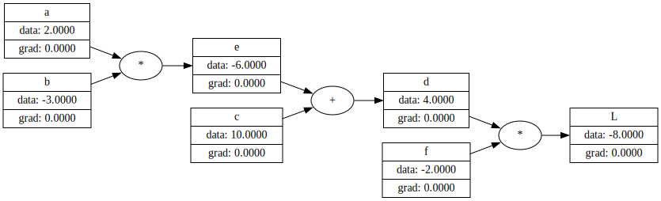

# TinyGrad
[](https://github.com/akoskovacs/tinygrad/actions/workflows/ruby.yml)

_A blatant copy of Andrej Karpathy's micrograd Autograd engine, with a PyTorch-like API in Ruby._

Look for the original version, in Python at [karpathy/micrograd](https://github.com/karpathy/micrograd).

Also watch his excellent lecture on the subject [here on Youtube](https://www.youtube.com/watch?v=VMj-3S1tku0&ab_channel=AndrejKarpathy).


## Installation [TODO]

```sh
gem install tinygrad
```

## Usage

The usage works the nearly the same way as the original, just with a `Ruby` syntax:
```ruby
# Create the DAG of expression 'l' out of simple components,
# label each one for clarity on the image
a = TinyGrad::Value.new(2, label: 'a')
b = TinyGrad::Value.new(-3, label: 'b')
c = TinyGrad::Value.new(10, label: 'c')
e = a * b ; e.label = 'e'
d = e + c ; d.label = 'd'
f = TinyGrad::Value.new(-2, label: 'f')
l = d * f ; l.label = 'L'
```

To generate the `DAG` (Directed acyclic graph), just use the `TinyGrad::Graph` class:
```ruby
graph = TinyGrad::Graph.new
graph.draw(l, file_name: 'simple_expression.svg')
```
This will generate the following image, of the forward pass:


## Development

After checking out the repo, run `bin/setup` to install dependencies. Then, run `rake spec` to run the tests. You can also run `bin/console` for an interactive prompt that will allow you to experiment.

To install this gem onto your local machine, run `bundle exec rake install`. To release a new version, update the version number in `version.rb`, and then run `bundle exec rake release`, which will create a git tag for the version, push git commits and the created tag, and push the `.gem` file to [rubygems.org](https://rubygems.org).

## Contributing

Bug reports and pull requests are welcome on GitHub at https://github.com/[USERNAME]/tinygrad. This project is intended to be a safe, welcoming space for collaboration, and contributors are expected to adhere to the [code of conduct](https://github.com/[USERNAME]/tinygrad/blob/master/CODE_OF_CONDUCT.md).

## License

The gem is available as open source under the terms of the [MIT License](https://opensource.org/licenses/MIT).

## Code of Conduct

Everyone interacting in the Tinygrad project's codebases, issue trackers, chat rooms and mailing lists is expected to follow the [code of conduct](https://github.com/[USERNAME]/tinygrad/blob/master/CODE_OF_CONDUCT.md).
